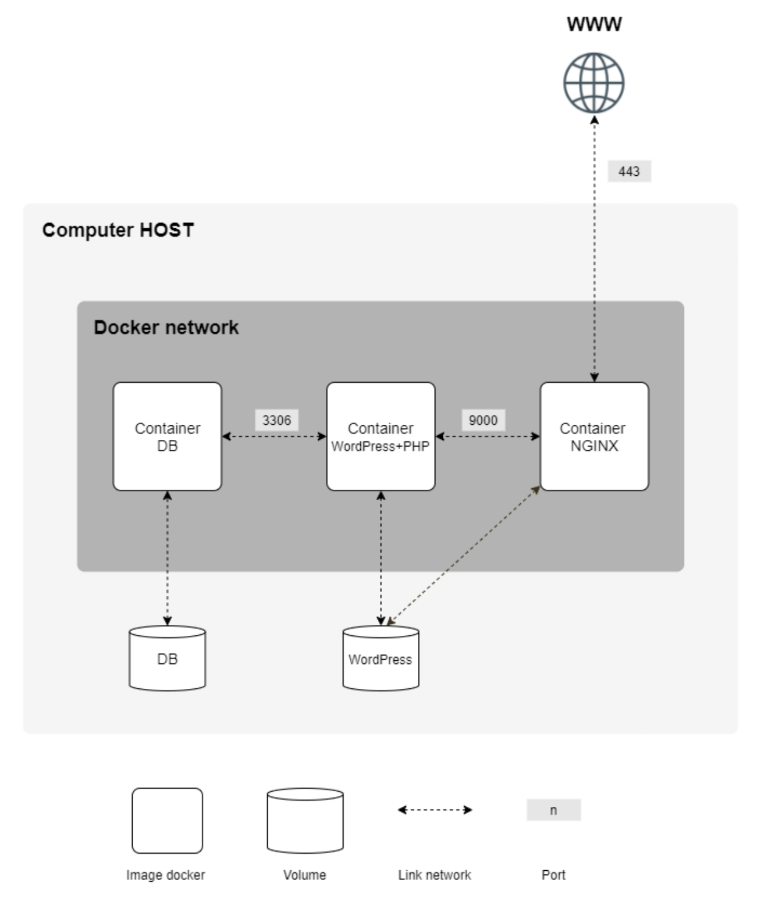

# docker_compose_LEMP
Реализация LEMP стека в docker контейнерах под управлением compose

Схема развертывания контейнеров:

- Запуск сервиса - команда make. 
  По локалосту будет доступен сайт на wordpress, доступ к его файлам осуществляется через связку nginx + fpm. Предустановлено два пользователя: админ и обычный юзер (имя пользователей и пароль смотреть/исправлять в файлах с расширением .env).
- Остановка - make stop. При остановке сервиса все изменения сохраняются в docker volumes локально на хосте.
- Остановка и очистка всех сохраненных изменений - make fclean.
